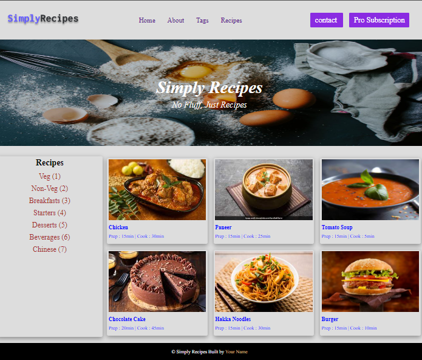

## Output

## For adding a button
```
const navbar = document.querySelector('.nav-center'); 
let buttons= navbar.lastElementChild; 
let button2 = document.createElement("ahref");
button2=document.createElement('a')
buttons.appendChild(button2)
button2.innerHTML="Pro Subscription";
button2.setAttribute("class","btn");
```
## For Adding Chinese option in the list
```
let foodMenu = document.querySelector(".tags-container");
let list = foodMenu.firstElementChild.nextElementSibling; 
let chinese = document.createElement("a"); 
chinese.innerHTML="Chinese (7)";
list.appendChild(chinese);

```
## for changing the color of the element in the recipe section
```
let recipeGrid=document.getElementsByClassName("recipe-name");
let recipeArray = Array.from(recipeGrid);;
recipeArray.map((e)=>{ e.style.color="blue" })
let recipePara = document.querySelectorAll(".recipe-disp"); 
let paraArray = Array.from(recipePara); paraArray.map((e)=>e.style.color="blue")
```

## for creating the sixth recipe card
```
let recipeGrid= document.querySelector(".recipe-gallery");   
let card6 = document.createElement("div"); recipeGrid.appendChild(card6);
card6.setAttribute("class","card");
let aHref = document.createElement("a"); let burgerImg = document.createElement("img"); 
burgerImg.src="https://static.toiimg.com/thumb/83565509.cms?width=1200&height=900"
aHref.appendChild(burgerImg)
card6.appendChild(aHref)
burgerImg.setAttribute("class", "recipe-img")
aHref.setAttribute("class","recipe-text"); 
let recipeName = document.createElement("h5"); 
recipeName.innerText="Burger"; aHref.appendChild(recipeName);
recipeName.setAttribute("class","recipe-name")
let paraGraph = document.createElement("p"); 
paraGraph.setAttribute("class","recipe-disp"); 
paraGraph.innerText="Prep : 15min | Cook : 10min"; 
aHref.appendChild(paraGraph);
```