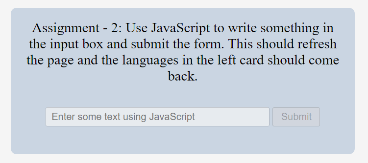

# Task-1
### Before

### After

```
let leftBoxContent = document.querySelector('.main__languages').children;
for(let i = 2; i<leftBoxContent.length; i++){
     if(i%2!=0)
     {leftBoxContent[i].style.display="none"}
     };
```

# Task-2
### Before

### After

```
let inputBox = document.querySelector('.main__form-input');
let submitButton = document.querySelector('.main__form-btn'); 
inputBox.disabled=false; 
submitButton.disabled=false;
inputBox.placeholder="iNeuron"
```
